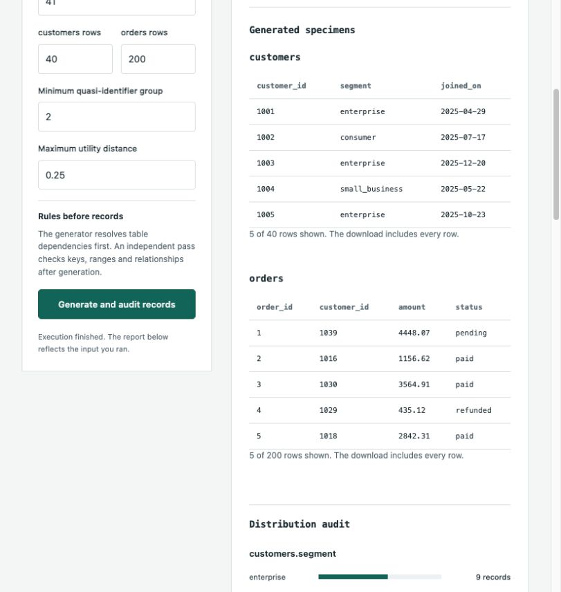
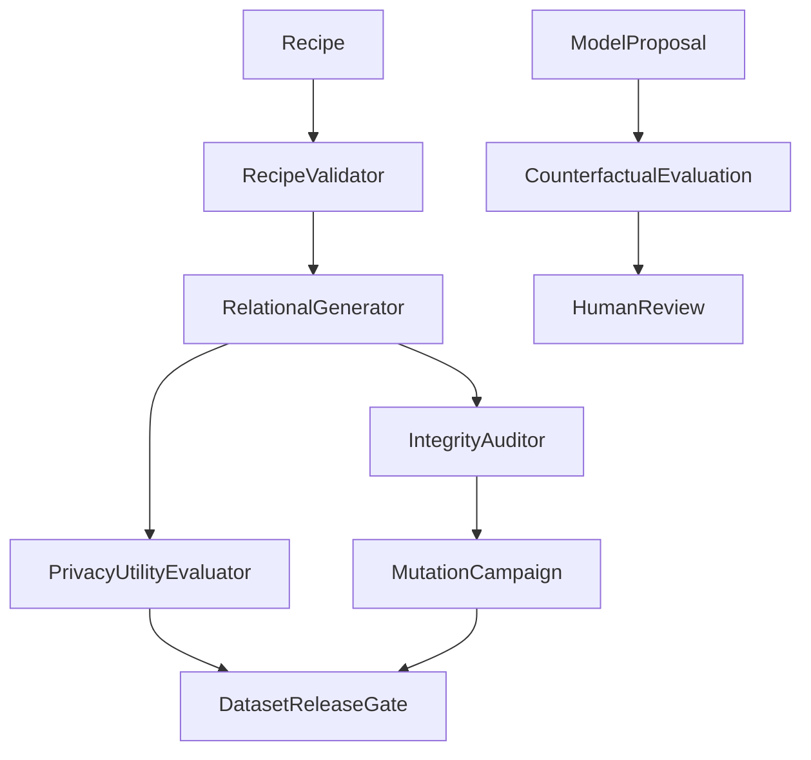

# Synthetic Data Assurance Lab



A reproducible test-data application that generates relational datasets, measures quality and exposure, and evaluates release controls before the data is used downstream.

[Open application](https://Snuthakki21.github.io/synthetic-data-assurance-lab/) · [Architecture](docs/ARCHITECTURE.md) · [Data and AI contracts](docs/CONTRACTS.md) · [Operator workflows](docs/WORKFLOWS.md) · [Runbook](docs/PRODUCT_RUNBOOK.md) · [Tests](tests)

## The operating problem

Integration tests need relationships and boundary cases, while data owners need evidence that a fixture is valid. Generation alone is insufficient: plausible records may violate a foreign key, omit a category, repeat identifying combinations or conceal an ineffective validator.

## End-to-end workflow

### 1. Define a versioned recipe

Choose table counts, enum weights, exact numeric ranges, dates and declared parent relationships. The recipe is rejected before generation if a foreign-key domain cannot contain its generated parents.

### 2. Generate and independently audit

The same seed yields the same records. Optional corruption probes deliberately violate constraints after generation, so a passing generator is never used as evidence that its auditor works.

### 3. Compare utility and exposure

Inspect categorical total-variation distance, optional numeric reference comparisons, quasi-identifier group sizes and exact non-key reference overlap. Reference records must conform to declared domains.

### 4. Run the quality campaign

At most 64 individual faults test nullability, keys, domains and relationships. A corrupt baseline blocks campaign interpretation instead of treating pre-existing failures as successful mutant detection.

### 5. Review release evidence

The gate combines integrity, mutation detection, marginal utility, measured group size and required reference coverage. A model range proposal is evaluated on a separate candidate dataset and remains unapplied.

## Run locally

Python 3.11 or later is required. The domain runtime uses the standard library and needs no model credential for local execution.

```bash
python3 -m portfolio run synthetic_data_foundry
python3 -m portfolio build
python3 -m portfolio serve --port 8765
```

Open the loopback address printed by the server. The public application executes the same packaged Python source in its browser worker. Browser workspace records remain in that browser; the native service stores its workspace in SQLite. See [running and deployment](docs/RUNNING.md) for the complete platform and optional provider setup.

To run a saved input:

```bash
python3 -m portfolio run synthetic_data_foundry --input examples/base.json
```

The full JSON editor exposes every supported field. Domain controls cover frequent adjustments; included scenarios exercise passing, held and review-dependent outcomes. Reports can be downloaded with their provenance and complete evidence, including rows beyond the visible table preview.

## Application architecture



`ProductApplication` coordinates independently testable domain services. The compatibility adapter contains metadata and original example scenarios; it no longer owns the domain algorithm. QualityPolicy and ExposureProfile represent validated policy and measured exposure. Rules and records stay separate from model proposals.

| Domain module | Classes | Responsibility |
|---|---|---|
| `schema.py` | `RecipeValidator` | Validates versioned tables, exact bounds, nullable policies and acyclic parent dependencies. |
| `generation.py` | `RelationalGenerator` | Produces reproducible parent-before-child datasets with seeded sampling. |
| `integrity.py` | `IntegrityAuditor` | Independently checks types, domains, decimal precision, uniqueness and foreign keys. |
| `assurance.py` | `PrivacyUtilityEvaluator / MutationCampaign / DatasetReleaseGate` | Computes exposure and utility, injects bounded faults and combines explicit release controls. |
| `analysis.py` | `SyntheticDatasetService` | Assembles generation, validation and distribution evidence. |

## Repository structure

```text
app/
  domain/       # Product-specific validation, entities and algorithms
  application/  # ProductApplication orchestration
  ai/           # Constrained assistance and measurable output evaluation
  platform/     # Versioned scenarios, SQLite repository, execution/review services
projects/synthetic_data_foundry/
  project.py    # Compatibility adapter and original scenarios
  fixtures/     # Original, non-production data
portfolio/      # Runtime, API/CLI integration and browser package builder
web/templates/  # This product's distinct operating workspace
web/            # Browser worker, accessible controls and workspace persistence
tests/          # Domain, AI boundary, persistence and integration tests
docs/           # Architecture, contracts, workflows and operating evidence
.github/        # Continuous verification and application deployment
```

## Input contracts

| Input | Rules |
|---|---|
| `quality_policy` | minimum_group_size 1–100; maximum_distribution_distance 0–1; boolean require_reference. |
| `quasi_identifiers` | Up to eight unique declared columns per table. Default measurement uses up to two enum columns. |
| `reference_records` | Optional 1–5,000 domain-valid reference rows per declared table; never fetched from a private source. |
| `audit_overrides` | Explicit scalar cell mutations, applied only to generated baseline records. |
| `rule_request` | Optional natural-language request for a narrower independent numeric range. |

Every input is validated before it can be used to make a domain decision. Unknown or malformed evidence fails explicitly; stale evidence is retained as stale rather than silently treated as current. See [contracts](docs/CONTRACTS.md) for the report and model boundaries.

## Results and evidence

- assurance.exposure: smallest measured group, uniqueness fraction and explicit reference overlap.
- assurance.utility: categorical distance or normalized numeric mean difference with a named baseline.
- mutation_campaign: individual injected faults, detection count, survivors and baseline status.
- release_gate: observed values, policy requirements and eligible_for_owner_review or hold.
- ai_evaluation: separate counterfactual integrity and changed-row measurements when a model proposal exists.

## AI architecture

The optional model proposes a narrower numeric range through a closed JSON schema. An allowlist, exact-scale checks and original-bound checks reject invalid proposals. RuleProposalEvaluator generates a separate seeded candidate and runs the independent auditor again. No proposal mutates the original rules or records. This demonstrates constrained generation, deterministic guardrails, counterfactual evaluation and human acceptance as distinct responsibilities.

Local operation is deterministic apart from explicitly seeded simulation and measured timings. Optional providers are an additional assistance path, not an undisclosed replacement for the domain algorithm. Provider-backed responses undergo JSON/schema and product-specific validation; failed provider calls do not become invented successful answers. No model credentials are embedded in the public application.

## Verification

```bash
python3 -m unittest discover -s tests -v
python3 -m pip install -r requirements-dev.txt
python3 -m coverage run -m unittest discover -s tests
python3 -m coverage report
node --test tests/frontend.test.mjs
```

Tests exercise domain invariants, negative inputs, exact boundaries, model-output rejection, stale evidence, workspace persistence and packaged execution. Coverage reports are execution evidence rather than a certification of correctness. Independent review findings and validation records are maintained in [docs](docs) and the project review record; historical review artifacts identify their reviewed revisions.

## Deployment and operating boundary

Original invented rules do not reproduce a private population. Marginal similarity does not establish joint-distribution fidelity, causal validity, anonymity or differential privacy. Generation is bounded to 50,000 rows, 12 tables and 32 columns per table; mutation campaigns retain one changed dataset view at a time. No external target-database writer, warehouse connector or publication service is present. Native workspace SQLite stores scenario, execution and review records; it does not write generated datasets into operational target systems.

The native service is an explicitly single-operator local application. Browser storage is not a shared backend. Internet-facing multi-user operation would require genuine authentication, authorization, tenancy and operating controls before deployment. The shipped application does not pretend those integrations already exist.

## Troubleshooting

A failed integrity baseline prevents meaningful mutation scoring. Fix the named cell or recipe and rerun. If utility fails, inspect the named baseline and sample size before changing the threshold. If exposure fails, reconsider quasi-identifiers and intended use rather than relabeling the dataset private.

## Data and licenses

Included inputs are original synthetic fixtures. No customer, employer or private financial records are distributed. Source and dependency notices are described in [LICENSE](LICENSE) and [third-party notices](docs/THIRD_PARTY.md).

## Persistent workspace

The interface includes a versioned scenario library, execution history, exact input/result replay, outcome comparison and evidence reviews. GitHub Pages persists records in this browser; the native server uses SQLite with optimistic revisions, idempotent execution reservations and a verifiable audit chain. Application and workspace data remain independent of every other repository.

See [workspace workflows, installation, container, backup and recovery](docs/WORKSPACE.md), [HTTP API contracts](docs/API.md), [domain Staff Engineer review](docs/STAFF_REVIEW_V2.md), [platform Staff Engineer review](docs/STAFF_PLATFORM_REVIEW.md), and [measured validation](docs/VALIDATION.md).
