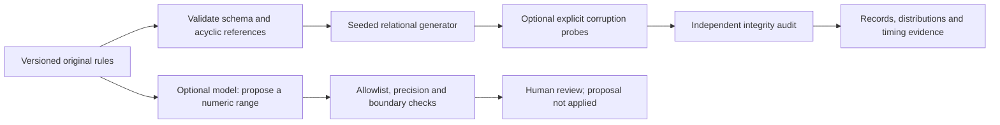

# Synthetic Data Assurance Lab

**Decision for an executive:** give engineering teams reproducible data without copying customer records, then demonstrate exactly which quality checks passed. The default original fixture creates 40 customers and 200 orders. A second scenario deliberately breaks a relationship and decimal precision; the release recommendation changes to hold.

**Evidence of Principal capability:** relational dependency scheduling, exact decimal boundaries, seeded reproducibility, independent validation and measured generation versus validation cost. **Evidence of Director capability:** a reusable test-data product with versioned ownership, transparent quality gates and a clear path from local proof to an enterprise service. This is an independently built reference application, not a claimed employer deployment or business outcome.

## Run and inspect

From the repository root:

```bash
python -m portfolio run synthetic_data_foundry
python -m portfolio run synthetic_data_foundry --input projects/synthetic_data_foundry/fixtures/broken_integrity.json
python -m unittest discover -s tests -p 'test_synthetic_data_foundry.py' -v
```

The report includes `details.records`, independently computed constraint failures, rule version, seed, per-enum distributions and separate timing measurements. Change `row_counts`, bounds, weights, nullable rates or seed and rerun. Original inputs are in [fixtures](fixtures). The rule-request field can ask the optional provider for a structured narrower numeric-range proposal. Valid proposals remain **unapplied until reviewed**; edit and version the rules to adopt one.

## Architecture and boundary



`run(payload, context=None)` is pure local computation except the optional shared model context. Every table declares an integer primary key; foreign keys reference declared parent primary keys. Parents generate first, then children sample existing keys. Supported fields are bounded integers, exact fixed-scale decimals, categorical strings and ISO dates. Nullable columns support explicit null rates. The validator independently checks values, keys and references after generation; it does not assume the generator succeeded.

The default backend is a rule-based generator, **not a trained generative model**. An LLM helps translate natural language to a constrained proposal. It has no authority to relax the validator, execute code or apply a rule. That separation puts deterministic guarantees where they can be tested and model assistance where it can be reviewed.

## Decisions and tradeoffs

| Decision | Benefit | Cost and production threshold |
|---|---|---|
| Original versioned rules instead of training on customer rows | Reproducible public data with a clear provenance boundary | Distributions are invented and do not demonstrate population fidelity |
| Exact minor-unit decimal sampling | No binary floating-point drift | Scale limited to six decimal places |
| Acyclic integer foreign keys | Fast generation with guaranteed parent membership | Self references and cyclic data require staged constraint handling |
| Independent auditor after generation | Detects invalid probes and future generator regressions | Adds measured validation time |
| In-memory bounded runner | No infrastructure or credentials required | 12 tables, 32 columns per table, 25,000 rows per table, 50,000 total |

## Measurable evaluation

17 unit-test methods cover reproducibility, changed seeds and row counts, dependency order, exact boundaries, null distributions, weight changes, referential integrity, decimal violations, duplicate keys, unsupported types, cycles and rejected model proposals. Subcases exercise additional malformed inputs. Tests assert computed behavior, not a static successful response.

Generation and validation milliseconds are measured independently during each run and vary with the machine. Enum total-variation distance compares generated frequencies with the **declared invented distribution**; it is descriptive sampling variation, not a fidelity score. Zero nonnull observations yield no distribution score. No production savings or throughput claim is made.

## Limits and production roadmap

There are no cross-field business rules, learned joint distributions, differential privacy, anonymization guarantee or warehouse connector. Keys identify invented records. Synthetic data can still leak information if future rules or learned distributions derive from private records; that requires a separate privacy assessment.

A production progression would add owner-reviewed cross-field rules and edge-case suites, batch streaming and resource quotas, isolated warehouse adapters, lineage and retention controls, and a separately evaluated privacy model for any learned generator. Acceptance requires real workload measurements and domain-owner review rather than a passing fixture alone.

See [engineering review](docs/engineering-review.md) for traceable acceptance checks, plugin contributions and review limits.

Measured local module coverage, with source and test hashes: [coverage-summary.json](docs/coverage-summary.json). Coverage is execution evidence, not proof of correctness; provider integration and independent automated review are separate checks.
